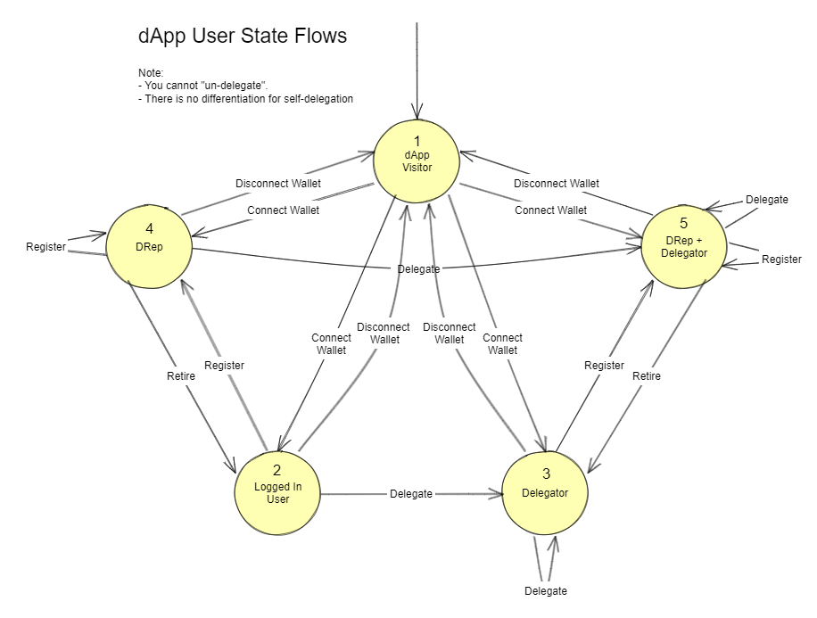
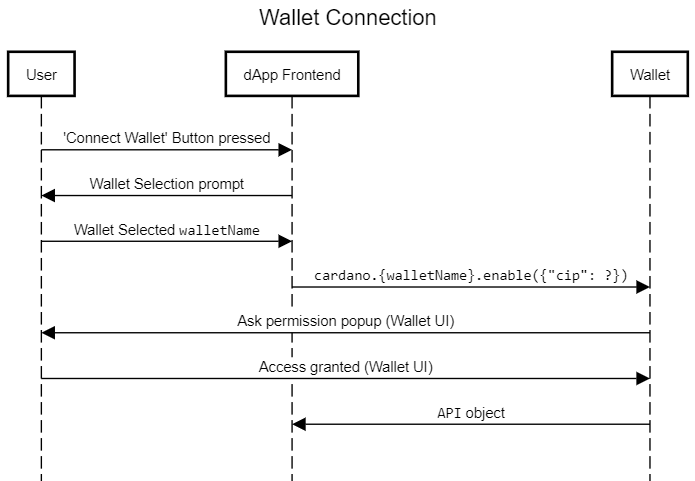
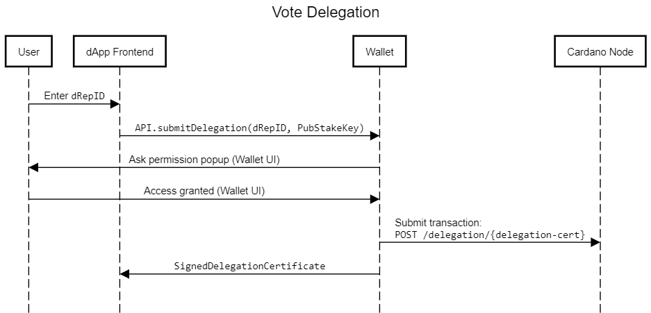
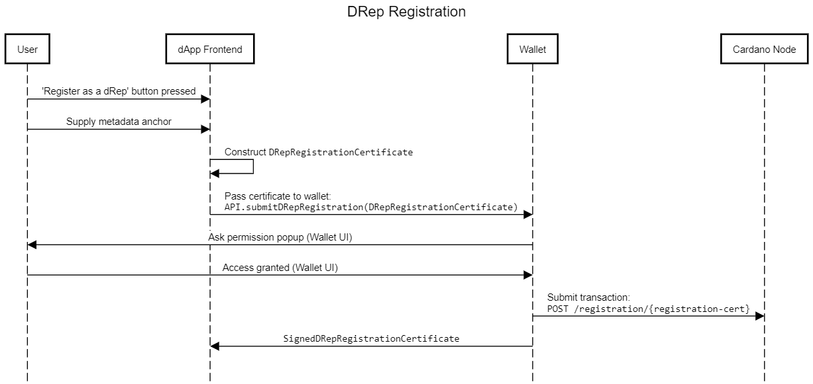
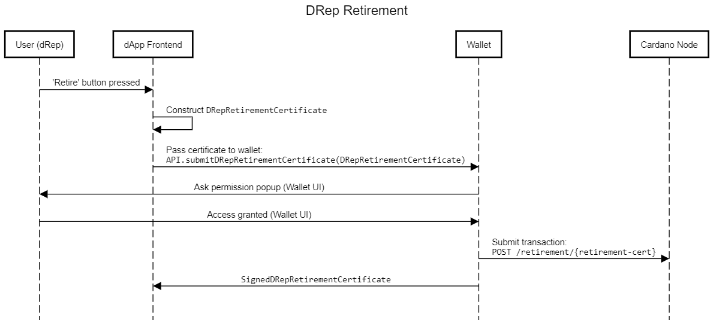
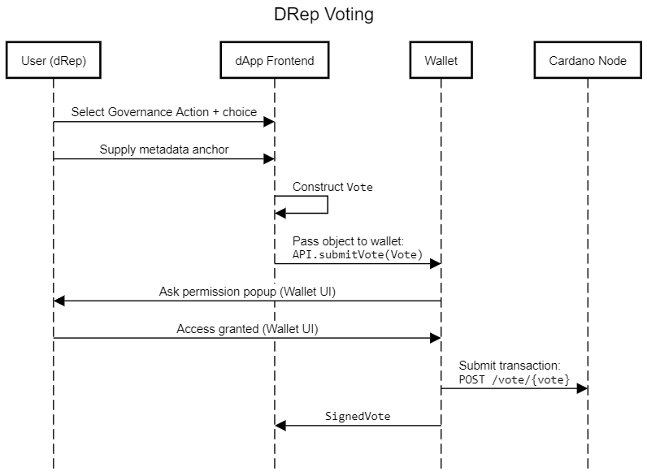
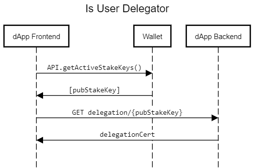
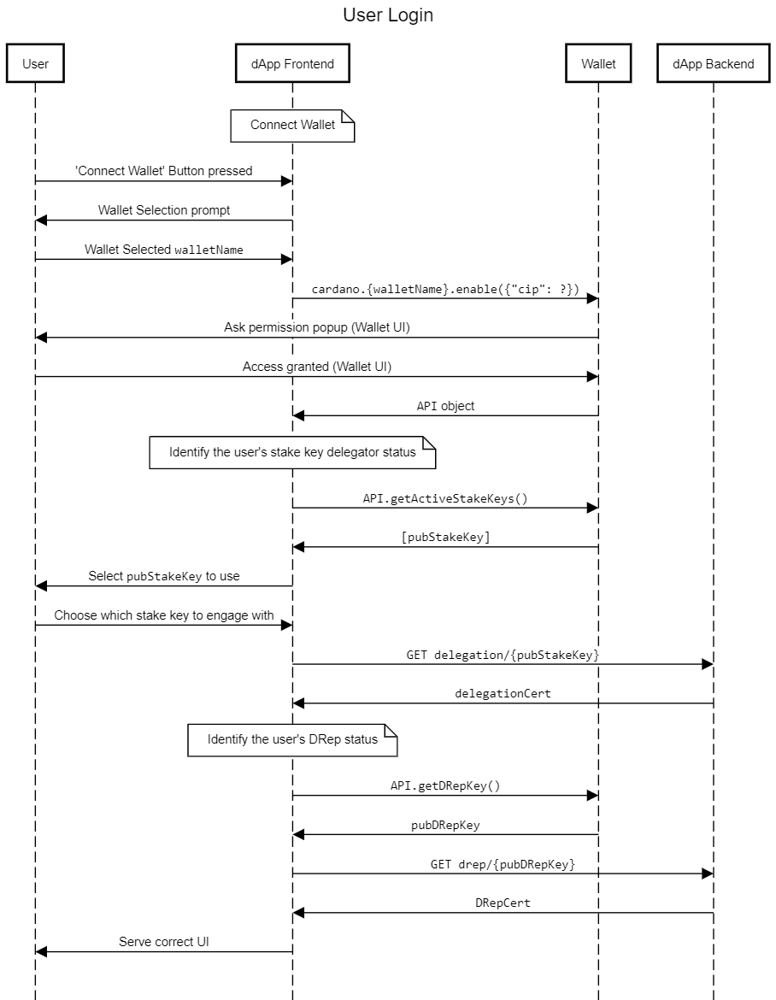

## Voltaire Voting App

### Introduction

The Voltaire Voting App (VVA) allows users to interact with Cardano's protocol governance as introduced in [CIP-1694 | A proposal for entering the Voltaire phase](https://github.com/cardano-foundation/CIPs/pull/380). Offering the ability for DRep Registration, Vote Delegation and Voting on Governance Actions.

VVA is likely to be some of the first tooling to be implemented for the Cardano eco-system to engage with CIP-1694. Other tooling efforts should fully support all users of CIP-1694.

Here we introduce the necessary concepts, similar approaches and then describe the intended technical architecture and approach for VVA.

### Background - Cardano's Governance

In this section we will introduce the environment in which VVA in habits, we will focus on the elements most important to VVA's design, summarizing CIP-1694. Please see CIP-1694 for full details.

[CIP-1694](https://github.com/cardano-foundation/CIPs/pull/380) proposes a significant revision of Cardano's on-chain governance system to support the new requirements for Cardano's Voltaire era. This proposal depreciates the previous governance structure, removing MIR certificates and current processes for protocol parameter updates. To be able support the new system, two new fields must be added to transaction bodies; governance actions and votes.

Governance actions will act as on-chain ballots, with any user able to submit them to enact change (see [here](https://github.com/JaredCorduan/CIPs/blob/voltaire-v1/CIP-1694/README.md#governance-actions)), with three distinct user groups elidible to cast their votes:
1. A constitutional committee
2. A group of delegate representatives (DReps)
3. the stake pool operators (SPOs)

Each governance action must be ratified by two of these three governance bodies using their on-chain votes. The type of action and the state of the governance system determines which bodies must ratify it.

Ratified governance actions may then be enacted on-chain, following the rules layed out in CIP-1694. 

#### Governance Actors

Whilst only three governance bodies are able to cast votes, additional consideration should be placed on those actors submitting governance actions and the Ada holders supporting. Note that these link to the personas described in XXXX.

##### **[Delegated Representatives](https://github.com/JaredCorduan/CIPs/blob/voltaire-v1/CIP-1694/README.md#delegated-representatives-dreps)**

DReps are modelled on, the existing, stake pool mechanism. Whereby any Ada holder is able to register a stake pool themselves to actively take part in block production or an Ada holder is able to delegate their rights to another stake pool who will act on their behalf. Instead of delegating Ada to take part in block production CIP-1694 describes delegating one's voting rights.

These entities can be identified by a verification key (Ed25519), or by a blake2b-224 hash digest of a serialized DRep credential is called the DRep ID.

Similarly to [stake pool process](https://developers.cardano.org/docs/operate-a-stake-pool/), DReps register their intent to be DReps on-chain via a certificate and can retire this duty via a retirement certificate.

They are identified on-chain by blake2b-224 hash digest of a serialized DRep credential. 

##### **Ada Holders**

Ada holders delegate their voting rights to DReps who then vote on the Ada holder's behalf. This is known as vote delegation and it associates a Ada holder's staked Ada with a DRep's ID. The generation and submission of this certificate is to be supported by VVA. These actors are identified on-chain via their staking credentials, or stake keys.

Conversely, Ada holders are also able to register as DReps and actively vote on their own behalf.

##### **[Constitutional Committee Members](https://github.com/JaredCorduan/CIPs/blob/voltaire-v1/CIP-1694/README.md#the-constitutional-committee)**

Constitutional committee (CC) members are a set of individuals or entities (each associated with a pair of Ed25519 credentials) that are collectively responsible for ensuring that the Constitution is respected. This system is modelled on the current system of genesis keys, whereby a quorum of keys must be present to administer governance over protocol parameter changes and MIR transfers. 

How CC members engage with 1694 are beyond the scope of this document.

##### **SPOs**

SPOs are the called upon to vote on three out of the eleven types of governance action, this makes them the least active voters. They are identified on-chain using their stake pool cold keys.

How SPOs engage with 1694 are beyond the scope of this document.

##### **Governance Action Submitters**

Gov action submitters could be any of the other actors. They are not identified on-chain in any particular manner. It is assumed that there will be some off-chain processing and refinement before a action is submitted to chain, but this is out of scope for this document.

#### On-Chain Entities

##### **[Vote Delegation Certificate](https://github.com/JaredCorduan/CIPs/blob/voltaire-v1/CIP-1694/README.md#vote-delegation-certificates)**

This certificate is used by Ada holders to associate the voting rights of their staked Ada with a DRep ID. The chain does not make it clear if the DRep ID is controlled by the issuer of the certificate or not. This certificate only includes the issuer's stake credential and a DRep ID, with this being signed using the stake credential's private key. There is no enforcement or checking by the Ledger that a provided DRep ID does actually belong to an DRep active DRep, this burden is on the Ada holder.

##### **[DRep Registration Certificate](https://github.com/JaredCorduan/CIPs/blob/voltaire-v1/CIP-1694/README.md#drep-registration-certificates)**

This certificate is used by an Ada holder to become a DRep. This certificate matches how SPOs register their intent to become SPOs. Included in this certificate is the issuer's DRep ID and a metadata anchor consisting of a URL to a JSON payload and a hash of the payload. This certificate is signed using the secret key associated with the DRep ID pre-hash key. The structure and format of this metadata is deliberately left open in CIP-1694, but it can be assumed to contain profile information about the DRep. Such as links to social media profiles, articulation of their beliefs to indicate to delegators the DRep's likely voting direction, expertise etc. 

It is assumed that DReps will submit registrations and then campaign with their DRep ID via social media channels to seek delegation. These users are incentivized to provide accurate and relevant information in their metadata anchor, to increase the chances of delegation. The intension is that clients use the metadata hash to be able verify the correctness of the plain text at the metadata URL.  Metadata can be updated via the submission of a new certificate with updated metadata anchor.

Although many DReps will seek delegation and want to advertise their DRep ID this is not guaranteed. There can and will likely be Private DReps who register but do not publicly advertise their DRep ID or provide accurate metadata. These entities could be small communities of friends nominating one person to vote on their behalf, or whales.

##### **[DRep Retirement Certificate](https://github.com/JaredCorduan/CIPs/blob/voltaire-v1/CIP-1694/README.md#drep-retirement-certificates)**

This certificate is used to take a DRep to become a retired DRep, or back to being an Ada holder. This mirrors stake pool retirement certificates. This certificate includes the issuers DRep ID and the epoch number where the DRep will retire. Again, this certificate is signed using the secret DRep credential used to create the DRep's ID. 

Although there is no action forcing in-active DReps to submit this certificate, rather this is a way for the DRep to tell delegators that they do not wish to continue to engage as DRep.

##### **[Governance Action Transaction](https://github.com/JaredCorduan/CIPs/blob/voltaire-v1/CIP-1694/README.md#content)**

The governance action field of transactions can be populated with a lot of data. All governance action transactions should contain a deposit amount, reward address, metadata anchor and a hash value. Accompanying this is action specific content such as a hash of the new constitution for "Update to the Constitution". The precise details on these contents are likely to be adjusted as CIP-1694 matures.

Although not described within the CIP, it is likely that there will be some informal off-chain process which prospective proposal submitters follower before posting these transactions to chain.

Once this transaction is accepted on-chain then it  will be assigned a unique identifier (a.k.a. the governance action ID), consisting of the transaction hash that created it and the index within the transaction body that points to it.

##### **[Vote Transaction](https://github.com/JaredCorduan/CIPs/blob/voltaire-v1/CIP-1694/README.md#votes)**

Vote transactions are used by the governance groups; CC, SPOs and DReps to articulate their feelings towards active governance actions. These field of transaction should be populated with the target governance action ID, the user's role (CC, SPO or DRep) a accompanying governance credential, a metadata anchor and their choice ('Yes'/'No'/'Abstain'). 

This should be signed using the provided secret side of governance credential, this will be checked to ensure it aligns with the provided role. Votes can be cast multiple times for each governance action by a single credential. Correctly submitted votes override any older votes for the same credential and role. 

#### Definitions

| Term                      | Definition | Pseudonym(s) |
| ------------------------- | ---------- | ------------ |
| Ada holder                | | |
| DRep                      | Delegate representative as described in CIP-1694. | |
| Retired DRep              | A DRep who previously registered but has now retired. | |
| Vote Delegation           | The act of submitting a vote delegation certificate, to associate ones's staked Ada with a DRep ID. | |
| Voting Power              | The amount of Ada a DRep yields from vote delegations. | |
| DRep Registration         | The act of submitting a DRep registration certificate to chain, to become a DRep. | |
| DRep Retirement           | The act of submitting a DRep retirement certificate to chain, to stop being a DRep. | |
| Current governance action | Governance actions which are elidible for voting. | |
| Metadata Anchor           | A URL and hash, used to link on chain data to off-chain data using the hash to ensure correctness. | |
| Private DReps             | Registered DReps who do not advertise their DRep ID for delegations. | |
| Governance State | | |
| | | |
| | | |
| | | |

#### Cardano's Project Catalyst

Project Catalyst is a community-driven governance platform developed on top of Cardano. It is designed to allow the community to propose challenges and then vote on the allocation of funding to projects which address these challenges.

The goal of Project Catalyst is to allow the Cardano community to have a say in the direction of the Cardano eco-system and to encourage participation and collaboration within the community. It is intended to be a transparent and democratic process for making decisions about the future of Cardano.

Participation during the innovation phase takes place primarily on [Catalyst's Ideascale website](https://cardano.ideascale.com/). Moving to [Catalyst Voting App](https://apps.apple.com/gb/app/catalyst-voting/id1517473397) to engage with the governance phase, submitting votes to the [Vote Storage Ledger](https://input-output-hk.github.io/catalyst-core/core-ledger-doc/introduction.html) Jormungandr.

Although the underlying technology used by Project Catalyst is substantially different from that of Voltaire, similar governance flows and parallels exist. Catalyst has been acting as Cardano's governance playground. 

##### **GVC**

To replace its Voting App, Catalyst is currently developing its own dApp, known as Governance Voting Center or GVC. This dApp allows users to connect their Cardano wallet to a web page via [CIP-0062? | Cardano dApp-Wallet Web Bridge Catalyst Extension](https://github.com/cardano-foundation/CIPs/pull/296). This CIP-62 connection is used to allow wallet's to share credentials with the dApp and for the dApp to use the wallet to sign and submit [CIP-36 | Catalyst/Voltaire Registration Transaction Metadata Format (Updated)](https://github.com/cardano-foundation/CIPs/blob/master/CIP-0036/README.md) compliant transactions.

This dApp allows users to the ability to register to vote, delegate voting rights and or sign up to be a Catalyst dRep. These flows are being inherited into VVA, and we will provide URLs GVC components to act as examples.

### App Tech Design

The VVA will not facilitate all interactions for all 1694 actors, rather VVA will focus solely on the requirements of Ada holders and DReps. 

Here we will give a description of VVA's technical design, throughout we will explain and justify the choice of design elements. This should act a suggested direction rather than a prescription.

#### High level

VVA will consist of a web app frontend, which can connect to Cardano wallets. A backend which can follow the Cardano blockchain and serve the frontend necessary data.

Here the approach is that users interact with the VVA's frontend UI, connecting their Cardano wallet over the CIP-??? API. VVA's backend uses it's chain follower to look for CIP-1694 on-chain entities and logs these into a database. The VVA FE is then able to query this database to look up a user's governance state.

One primary goal of VVA's design is to minimize the required work for supporting wallets. This is achieved by moving the burden of tracking a user's governance state on to the dApp. This is opposed to how staking is achieved with most wallet implementors integrating the certificate creation inside of their own software, to avoid the need to a dApp supported flow.

#### Alternative Approaches

While web-based stacks with wallet connectivity are able to offer users familiar experiences, this lowers the technical bar to entry for users to engage. This flow matches Catalyst's GVC overall design.

The primary alternative approach to this is wallet providers integrating this functionality fully inside of wallet software, matching how staking is often implemented. We deem this approach as preferable from a security standpoint for combined functionality and would encourage wallet providers to pursue this. But
we understand that this may add overhead to wallet designs so offer this dApp based/wallet-connect as an alternative.

#### MVP v Post MVP Elements

| MVP | Post MVP | 
| ---- | --- |
| DRep Registration | Anchored metadata hosting |
| DRep Retirement | DRep aggregator/ explorer |
| DRep Voting | Proposing governance actions |
| Vote Delegation by Ada holders | Submitting governance actions to chain |
| Viewing and filtering current governance actions | CC Voting |
| | SPO Voting |

#### Feature Elements Overview

VVA will use its backend chain follower to follow the on-chain state of governance to allow users to:
- View and filter current governance actions
- Tell you current governance state - are you a DRep?
- Tell you current governance state - have you delegated?
- Tell DReps which way they have voted
- Tell delegators who they have delegated to

VVA will use connected wallet to 
- Sign and submit DRep registration certificates
- Sign and submit DRep retirement certificates
- Sign and submit vote delegation certificates
- Sign and submit vote transactions

// add in links to Thomas' doc

#### dApp-Wallet Connector

In order to allow the creation of VVA we have defined a dApp-wallet web bridge. This specifies the communication between Cardano wallets and the VVA for CIP-1694 related data exchange. Particularly this specifies what credentials wallets should share with dApps and what data should be passed to wallets to build, sign and submit [CIP-1694 chain entities](#on-chain-entities).

This standard extends the [CIP-30 | Cardano dApp-Wallet Web Bridge](https://github.com/cardano-foundation/CIPs/tree/master/CIP-0030) to introduce specific functionality described in CIP-1694.

#### Key Management

Since VVA and CIP-???? are only concerned with DReps and Ada holders only the credentials of these entities are needed to be considered. As described in prior sections DReps are identified by a Ed25519 key pair and Ada Holders are identified by stake credentials. 

Since there are two sets of credentials to track this means a single wallet user can be both a delegator and a DRep at once.

##### **Stake Key**

Staking keys are derivation is well described by [CIP-11](https://github.com/cardano-foundation/CIPs/tree/master/CIP-0011) which builds on Cardano's key derivation as described in [CIP-1852](https://github.com/cardano-foundation/CIPs/blob/master/CIP-1852/README.md). Most (all) Cardano wallets follow these standards, allowing them to find a user's stake keys from a provided mnemonic. This means that wallets will easily be able to share this information with VVA, to allow VVA to find a user's governance state. 

One note here is that while most wallets support single stake key wallets, some do support Multi-stake Key Wallets ([CIP-18](https://github.com/cardano-foundation/CIPs/tree/master/CIP-0018)) meaning that a single user account can control multiple stake keys. This means that if a user's wallet supports this a user is able to delegate to multiple DReps at once. This does introduce some complexity on the side of the dApp's implementation. The way we have planned to navigate this is on wallet connection the user selects which stake key from their wallet they wish to use for that session. Each of the user's stake keys can be delegated or not to multiple DReps, at once.

VVA can use a user's stake key to index the BE for the key's latest delegation certificate, with this the FE can show the user the ID of the DRep they most recently delegated to.

##### **DRep Key**

As described in CIP-1694 DReps can be identified via a Ed25519 public key. Whilst this affords the system a lot of freedom without a derivation path, key discovery for wallets is impossible. Without a derivation path wallets are unable to derive these keys from a user's mnemonic. To allow wallet derivation in CIP-???? we define a derivation path for DRep keys. With this path wallets can deterministically find a user's DRep key and share this with VVA.

Unlike stake keys CIP-???? suggests that only one DRep key should be derived per wallet account. This avoids the need for DRep Key discovery.

Recall from CIP-1694 a DRep ID is a blake2b-224 hash digest of a serialized DRep credential. This means that once a wallet shares the user's DRep key VVA can hash it to find the wallet's DRep ID. VVA can use a user's DRep ID and index the BE's list of active DRep's to see if the user is registered and if so their voting power.

#### User States vs Personas

Here we define five distinct user states, these somewhat differ from defined personas.

1. **dApp Visitor:** This is any user who visits the hosted web page frontend of VVA. In this state the user is able to view and filter governance actions. To move from this state the user must connect their Cardano wallet, this can transition the user to any other state.
2. **Logged in User:** A dApp visitor may transition to state 2 by connecting a wallet which does not control stake keys which have delegated and does not control a DRep key which is not registered. They may delegate to a DRep to transition to state 3, or register as a DRep to move to state 4. To transition back to a dApp visitor they can disconnect their wallet.
3. **Delegator:** Delegators may stay in the same state by re-delegating to a different DRep. They may register to become a DRep to transfer to state 5 or disconnect their wallet to return to state 1.
4. **DRep:** DReps may delegate to move to state 5, submit a retirement to move to state 2 or disconnect their wallet to move back to 1. They may submit a new registration transaction to update their metadata keeping them in the same state.
5. **DRep + Delegator:** In this state users can re-delegate or re-register and stay in the same state. Users may submit a DRep retirement to return them back to state 3, or disconnect their wallet to return to state 1.

All of the described flows are captured in the personas articulated in the XXXX document. Notably the personas are likely to span and overlap with what states the user will enter. 

#### Data Flows Summary

Here we will summarize the data flows needed to be invoked by the VVA frontend. See swagger for full break down. 

We can categorize the calls into two distinct groups based on the source or the location that is being called, either the VVA backend or the connected wallet. The general approach is that the FE fetches data from the BE to show the user. The FE connects to the users wallet to fetch credentials to be able to identify the user and the FE uses the connect wallet to sign and submit transactions to Cardano.

##### FE <-> Wallet

All of these endpoints are described within CIP-????, here we describe them with user states and action.

| User state     | Action | Req Link | Endpoint |
| -------------- | --- | --- | --- |
| dApp Visitor   | Login - Share stakes key(s) | N/A | GET /stake-key/ |
| dApp Visitor   | Login - Share DRep key | N/A | GET /DRep-key/ |
| Logged In user | Register as dRep | N/A | POST /drep |
| Logged In user | Delegate | N/A | POST /delegation |
| Delegator      | Register as dRep | N/A | POST /drep |
| Delegator      | Delegate | N/A | POST /delegation |
| DRep           | Re-register as dRep | N/A | POST /drep |
| DRep           | Delegate | N/A | POST /delegation |
| DRep           | Retire | N/A | POST /retirement |

##### FE <- BE

| User state | Action | Req Link | Prerequisite | Endpoint | BE Source | Processing |
| --- | --- | --- | --- | --- | --- | --- |

#### Frontend

We will briefly outline what the frontend web app could look like. We not wish to be too prescriptive here past an API driven *some web app* that has the ability to talk to the backend and Cardano wallets and the BE.

// compare to GVC

##### wallet-connector

This component of the frontend is responsible for communication with the wallet. This should capture the API offered.

// compare to GVC

#### Backend
 
Here we will describe what BE components we believe are necessary for VVA to meet its requirements.

The VVA backend must be able to read transaction and governance state information from Cardano, this data must then be saved in a database which can then be queried by the VVA FE. 

##### **Chain Follower**

A chain follower/indexer is a software component that continuously monitors the Cardano blockchain for new blocks and transactions. It then processes the information contained in these blocks and transactions and makes it available for further analysis and processing.

**Why do we need it?**

The chain follower is used to extract the Voltaire related data from blocks and transactions and store it in a database which can then be easily transferred. This is necessary because blockchains in general are difficult to index. By filtering block data to only include Voltaire adjacent information we allow much more efficient indexing.

The FE needs to be able to quickly lookup the governance state of a user (is a DRep? Is a delegator?) from user login time.

**How a Chain Follower/Indexer Works?**

A chain follower/indexer typically works in the following way:

Connect to the Cardano blockchain: The chain follower/indexer connects to a Cardano node to access the blockchain data.

Monitor new blocks: The chain follower/indexer monitors the Cardano blockchain for new blocks and transactions. It keeps track of the current block number, and waits for new blocks to be added to the blockchain.

Process Blocks and Transactions: Once a new block is added to the blockchain, the chain follower/indexer processes it to extract relevant information. The relevant information is configurable for our use case this is Voltaire related information.

Save Information to a Database: After processing the block, the chain follower/indexer saves the extracted information to a database. The database can be a traditional SQL database or a NoSQL database like MongoDB, depending on the use case.

Handle Reorganizations and Forks: The chain follower/indexer must also handle chain reorganizations and forks. If the chain is reorganized or forked, the chain follower/indexer must be able to detect this and adjust accordingly.

**What it looks like deployed?**

When deployed, the chain follower/indexer is typically a standalone software component that runs on a server. It connects to a Cardano node via an API or socket, and interacts with a database to store and retrieve blockchain data. The system can be monitored and managed via a web-based interface, which displays metrics like the current block number, processing rate, and database size.

**How other systems do this / technology choices**
- Lace 
- GVC
- Blockfrost 

**Our Filters**

// vs ledger state 

Technical Choices:

// what is it
// why do we need
// how does it work
// what could it look like
// alternatives

##### **Database**

- what data we need

### Technical Design

Here I will outline specific implementation details for each feature works.

#### Wallet Connection

We equate connecting a wallet to VVA as logging into VVA. VVA uses the CIP-??? standard to connect to and communicate with Cardano wallets. This process involves a user granting VVA access to their wallet’s CIP-???? API. Since CIP-???? is an extension to CIP-30, access to CIP-???? API implicitly enables access to the CIP-30 API.

#### Vote Delegation

The act of delegating is when a user associates the voting rights of their staked Ada with a DRep ID, so that the DRep can vote using the voting power of the staked Ada. This action can be performed from any user state in VVA, as 

Once logged in, a VVA FE a user enters the DRep ID of the DRep they wish to delegate to and VVA will pass the DRep ID along with the user's stake key to the wallet. The wallet can then 
use this information to construct a vote delegation certificate, then ask the user for permission to sign and submit this certificate in a transaction to chain.

Returned back to the FE is a signed object, which contains a the submitted certificate, the signature/witness on it and the hash of the transaction submitted to chain which contains this certificate.

#### DRep Registration

The act of DRep registration is when a user submits a DRep registration certificate to chain, declaring their DRep ID and linking a metadata anchor. This logs their DRep key on-chain in the form of a hash, this is important as it will be checked by the ledger when they submit a vote.

Once a user is logged into VVA, they are able to register as a DRep for the first time or re-register if they wish to update their metadata hash. This can be initiated by the user pressing 'Register as DRep' button. Next the user provides their metadata anchor to the FE, following this the FE generates the certificate object as described in CIP-????. The FE uses the user's DRep key provided previously along with the metadata anchor to construct this object and pass it to the wallet. The wallet can then use this information to construct a DRep registration certificate, and ask the user for permission to sign and submit this certificate in a transaction to chain.

Returned back to the FE is a signed object, which contains a the submitted certificate, the signature/witness on it and the hash of the transaction submitted to chain which contains this certificate.

#### DRep Retirement

The act of DRep registration is when a user submits a DRep retirement certificate to chain, declaring their DRep ID is not going to be associated with a active DRep anymore. This is an on-chain mechanism to tell people currently delegated to that DRep that they should move their delegation. In VVA this action can be performed by any user who has previously registered as a DRep.

Once logged in, a DRep can retire by pressing the 'Retire as DRep' button. This causes the VVA FE to construct a DRep retirement certificate object as described in CIP-???? passing in the connected wallet's DRep ID and a epoch retirement time of **TODO**. The wallet can then use this information to construct a DRep retirement certificate, and ask the user for permission to sign and submit this certificate in a transaction to chain. 

Returned back to the FE is a signed object, which contains a the submitted certificate, the signature/witness on it and the hash of the transaction submitted to chain which contains this certificate.

#### Voting

The act of voting via VVA is when DReps choose submit a vote transaction emitting their opinion for a given current governance action. This is only possible for those registered as active DReps. In the VVA FE this will take place on the governance action screen where the user is presented with the live governance actions.

The user should indicate to the dApp, through it's UI which governance action to vote on and the DRep's choice (yes, no or abstain). Additionally, DReps have the option to supply a metadata anchor. With this information the VVA FE can construct the vote object using the shared DRep credentials, this is then passed to the wallet. Where the wallet asks the user for permission to sign and submit.

Returned back to the FE is a signed object, which contains a the submitted certificate, the signature/witness on it and the hash of the transaction submitted to chain which contains this certificate.

#### View Governance Actions

// TODO

#### Is user DRep?

This is an internal call which requires no user interaction. This is likely to be used by the FE to work out if a newly connect wallet belongs to a DRep. This is likely to be a component part of a larger login flow, being preceded by a wallet connection.

#### Is user Delegator?

This is an internal call which requires no user interaction. This is likely to be used by the FE to work out if a newly connect wallet belongs to a delegator. This is likely to be a component part of a larger login flow, being preceded by a wallet connection.

#### Full Login Flow

When a user connects their wallet to VVA a flow is activated to check the user's governance state to be able to serve them the correct user interface.S This flow combines the [wallet connect](#wallet-connection) flow with the [Is user DRep](#is-user-drep) and [Is user delegator](#is-user-delegator).

### Edge Cases, whats missing?

- explicit definitions on guard rails/warnings:
    - for example: should we warn users if they try to re-delegate to the same DRep? (wasting transaction fees)