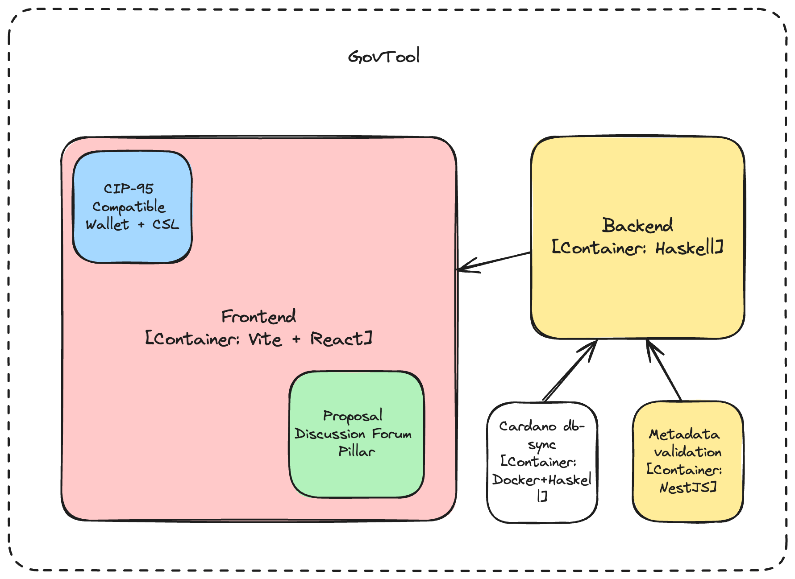

# GovTool Software Architecture Documentation

**Valid as of: 2026-10-01**

## Overview

GovTool is a decentralized application for [CIP-1694](https://github.com/cardano-foundation/CIPs/blob/master/CIP-1694/README.md) governance. The [`IntersectMBO/govtool`](https://github.com/IntersectMBO/govtool) repository contains:

- **Frontend** (`govtool/frontend`): React + Vite web app. It talks to the backend over REST (`VITE_BASE_URL`), including for metadata validation, and to wallets over CIP-30 / CIP-95. The Proposal Discussion pillar (`govtool/frontend/src/pdf-ui`), enabled with the `VITE_IS_PROPOSAL_DISCUSSION_FORUM_ENABLED` flag, and governance action history, always enabled, are part of the frontend source.
- **Backend** (`govtool/govtool-backend`): NestJS (TypeScript) read-only API on port 9999 (Swagger at `/swagger-ui`). It is the service built by CI and deployed (`ghcr.io/intersectmbo/govtool-backend`), and it also serves governance action records under `/governance-actions` and metadata validation under `/metadata`. It is configured through `GOVTOOL_*` environment variables, listed in [`govtool-backend/.env.example`](https://github.com/IntersectMBO/govtool/blob/develop/govtool/govtool-backend/.env.example).
- **Data providers**: the backend reads chain data through a provider-agnostic contract (`govtool/govtool-data-providers`). One package implements it per source:
  - `govtool-provider-dbsync`: cardano-db-sync (the default, used by the hosted deployments)
  - `govtool-provider-koios`: the public Koios API, a supported alternative that needs no database of your own
  - `govtool-provider-blockfrost`: the Blockfrost API (experimental)
  - `govtool-provider-fixture`: a frozen mainnet capture, for local development and tests with no network or credentials
- **Pinning and metadata packages**: `govtool-pinning-pinata` (IPFS uploads via Pinata), `govtool-pinning-test` (isolated test runs), and `govtool-metadata-http`, the backend's client for the metadata service.
- **Metadata service** (`govtool/govtool-metadata-service`, image `ghcr.io/intersectmbo/govtool-metadata-service`): resolves off-chain metadata anchors and keeps the documents and fetch reports in its own PostgreSQL database. It is private: only the backend reaches it. Metadata validation (`POST /metadata/validate`) is served by the backend and checks a document's hash and format against CIP-100 / CIP-108 / CIP-119; it replaces the standalone `govtool/metadata-validation` service, which has been removed.
- **Proposal Discussion backend** (`govtool/govtool-pdf-backend`): NestJS + Prisma + PostgreSQL replacement for the Strapi backend of the Proposal Pillar, wire-compatible with the API the `pdf-ui` calls. CI builds its image (`ghcr.io/intersectmbo/govtool-pdf-backend`), and it runs in the local fixture stack.
- **Analytics dashboard** (`govtool/analytics-dashboard`): Next.js internal dashboard. It is not part of the core deployment.

The Haskell backend (`govtool/backend`) and its TypeScript port (`govtool/backend-ts`) were removed in [IntersectMBO/govtool#4246](https://github.com/IntersectMBO/govtool/pull/4246), and the separate Outcomes Pillar service is no longer deployed. The Strapi + PostgreSQL backend it replaces is in [`IntersectMBO/govtool-proposal-pillar`](https://github.com/IntersectMBO/govtool-proposal-pillar). Deployment manifests live in [`IntersectMBO/govtool-argo`](https://github.com/IntersectMBO/govtool-argo) (Helm + Argo CD). For local development, see [Run GovTool Locally](../../cardano-govtool/run-govtool-locally/README.md).

The design decisions behind the data layer, the API surface and the provider contract are recorded in the repository under [`docs/api`](https://github.com/IntersectMBO/govtool/blob/develop/docs/api/README.md) and [`govtool-data-providers/SPEC.md`](https://github.com/IntersectMBO/govtool/blob/develop/govtool/govtool-data-providers/SPEC.md).

## Frontend

### Technology Stack

- [React](https://react.dev/): The library for web user interfaces.
- [Vite](https://vitejs.dev/): The build tool for modern web development.
- [TypeScript](https://www.typescriptlang.org/): The language for static typing.
- [@mui](https://mui.com/): The library for React components.
- [@tanstack/react-query](https://tanstack.com/query/latest): The library for data fetching.
- [react-router](https://reactrouter.com/): The library for routing.
- [react-hook-form](https://react-hook-form.com/) and [yup](https://github.com/jquense/yup): Forms and validation.
- [i18next](https://www.i18next.com/): Translations.
- [cardano-serialization-lib](https://github.com/Emurgo/cardano-serialization-lib) (`@emurgo/cardano-serialization-lib-asmjs`): Serialization and deserialization of Cardano data structures, and transaction building.
- The Proposal Discussion pillar UI (`src/pdf-ui`, vendored from `@intersect.mbo/pdf-ui`) and the governance action history UI, both part of the frontend source.

### Description

Frontend is a React application using Vite as a build tool to enhance development speed and optimize production builds. Frontend interacts with the backend service via REST API and with the Cardano blockchain via cardano-serialization-lib and connected supported wallets (for the list of compatible wallets go [here](../../cardano-govtool/using-govtool/getting-started/compatible-wallets.md)). Transactions are built in the frontend, and signed and submitted by the user's wallet.

### Components

- **Direct voter** - direct voter is a DRep which does not have a metadata and have all the ADA delegated to themselves. This component combines the registration and delegation process into one step. Direct voters are not visible in the DRep directory.
  Direct voters ui components are (no specific file names are provided as they might be continuously updated):

  - Direct voter registration card - UI component visible on the dashboard allowing to navigate to the Direct voter registration form. It displays current Direct voter status and amount of ADA.
  - Direct voter registration form - UI component allowing to register as a Direct voter and delegate all the ADA to themselves. Under the hood metadata anchor is mocked with provided default values.
    Direct voter uses following CSL services:
  - TransactionBuilder - to build the transaction
  - CertificatesBuilder - to build the delegation certificate
  - DRepRegistration - to build the DRep registration certificate

- **DRep** - DRep is a Delegated Representative which has metadata and can receive delegated Voting Power from other ADA holders. DRep registration and delegation are separate processes. DReps are visible in the DRep directory.

  DRep ui components are (no specific file names are provided as they might be continuously updated):

  - DRep registration card - UI component visible on the dashboard allowing to navigate to the DRep registration form. It displays current DRep status and amount of ADA.
  - DRep registration form - UI component allowing to register as a DRep. The form builds CIP-119 metadata (JSON-LD) that the DRep stores at a public URL; GovTool checks the URL and hash before building the registration certificate.
    DRep uses following CSL services:
  - TransactionBuilder - to build the transaction
  - CertificatesBuilder - to build the DRep registration certificate
  - DRepRegistration - to build the DRep registration certificate
  - DRepDeregistration - to build the DRep deregistration certificate
  - DRepUpdate - to build the DRep update certificate

**Note**

- A Direct Voter can become a DRep by providing the metadata.
- A DRep without metadata is shown as a Direct Voter.

- **DRep directory** - DRep directory is a list of all registered DReps. It displays DRep metadata, and amount of Voting Power. DRep directory is visible for all users. DRep directory is the part of delegation pillar.

  DRep directory allows to delegate ADA to DReps. It uses following CSL services:

  - Credential
  - DRep
  - Certificate
  - VoteDelegation

- **GA Submission** - GA Submission is a form allowing to submit a Governance Action. GA Submission is the part of governance pillar. GA Submission uses following CSL services:

  - TransactionBuilder - to build the transaction
  - CertificatesBuilder - to build the governance action certificate
  - GovernanceAction - to build the governance action certificate

  Additionally, GA Submission uses the backend's metadata validation (`POST /metadata/validate`) to check that the entered URL serves the document and that its hash matches. A failed check shows the full fetch report.

## Backend

### Technology Stack

- [NestJS](https://nestjs.com/) / TypeScript: The backend (`govtool/govtool-backend`) and its sibling packages, linked as `file:` dependencies.
- [cardano-db-sync](https://github.com/IntersectMBO/cardano-db-sync): A component that follows the Cardano chain (via a [cardano-node](https://github.com/IntersectMBO/cardano-node)) and stores blocks and transactions in PostgreSQL. It is the data source of the default `dbsync` provider.
- [Koios](https://koios.rest/) and [Blockfrost](https://blockfrost.io/): Public chain-data APIs, used by the `koios` and `blockfrost` providers instead of a db-sync instance of your own.

### Description

The backend is a read-only API. It keeps the routes and response bodies of the Haskell backend it replaced, which the frontend was written against, and adds `GET /system/capabilities` and `GET /system/features` (the feature set the frontend reads at boot), the metadata routes under `/metadata` (validation, plus resolving anchors and fetch reports through the metadata service) and the governance action routes under `/governance-actions`.

The backend holds no database handle of its own. Every chain read goes through the chain-data contract, satisfied by the provider named in `GOVTOOL_CHAIN_DATA_PROVIDER` (`dbsync`, `koios`, `blockfrost` or `fixture`). The db-sync provider owns its SQL queries (`govtool/govtool-provider-dbsync/src`). The backend caches the results in memory, warms the cache in the background, and returns governance data (DReps, proposals, votes, epoch parameters, transaction status) to the frontend. It does not talk to cardano-node directly. Transactions are built in the frontend and signed and submitted by the user's wallet.

The backend also offers an anonymous IPFS upload endpoint (`POST /ipfs/upload`), used for pinning vote rationale via Pinata when the user chooses "GovTool pins data to IPFS". It accepts only a CIP-100 JSON-LD document and is rate limited per client and per instance. Without `GOVTOOL_PINATA_API_JWT` it answers `503`.

## Data Storage

With the `dbsync` provider, the main data store is db-sync's PostgreSQL database, which GovTool reads but does not write to. With the `koios` or `blockfrost` provider, GovTool needs no database for chain data. The metadata service keeps resolved metadata and reports in its own PostgreSQL database, and the Proposal Discussion backend keeps its off-chain discussion data in its own PostgreSQL database.

## Architecture diagram

**Valid as of: 2024-06-06** (does not yet show the TypeScript backend, the data providers or the embedded pillars)

