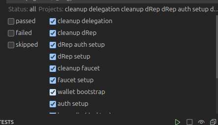

# 🚀 GovTool Integration Test Guide

## ✅ Prerequisites

Make sure the following are installed on your machine:

- **Git**
- **Node.js** & **npm**

---

## 🛠️ Setup Instructions

### 1. Clone the Repository

```bash
git clone https://github.com/IntersectMBO/govtool
```

### 2. Navigate to the Playwright Test Directory

```bash
cd tests/govtool-frontend/playwright
```

### 3. Configure Environment Variables

- Copy the `.env.example` file to `.env`:

```bash
cp .env.example .env
```

- Update the `.env` file with the appropriate values.

### 4. Install Dependencies

```bash
npm install
```

### 5. Install Playwright Browsers

```bash
npx playwright install
```

---

## 🧪 Running Tests

### 🔁 Run All Tests

```bash
npm run test
```

### ▶️ Run Specific Test Suites

1. **Delegation Pillars**

   ```bash
   npm run test:delegation-pillars
   ```

2. **Voting Pillars**

   ```bash
   npm run test:voting-pillars
   ```

3. **Outcomes**

   ```bash
   npm run test:outcomes
   ```

4. **Proposal Pillars**

   ```bash
   npm run test:proposal-pillars
   ```

5. **Proposal Discussion**

   ```bash
   npm run test:proposal-discussion
   ```

6. **Proposal Budget**

   ```bash
   npm run test:proposal-budget
   ```

7. **Wallet Connect**

   ```bash
   npm run test:wallet-connect
   ```

8. **Usersnap Integration**

   ```bash
   npm run test:usersnap
   ```

9. **Miscellaneous Tests**

   ```bash
   npm run test:misc
   ```

---

## 📊 Visualize Allure Report

To generate and view the Allure report:

```bash
npm run allure:serve
```

---

## 🖥️ Tip for VS Code Users (Running Individual Tests)

- Use the terminal to run any specific test suite using the commands above.
- Make sure all test files are recognized in the **Test Explorer**.
- Click the **Play** icon to run tests individually.



---

## 📚 Additional Resources

For development and contribution guidelines, refer to:

**`DEVELOPERS_GUIDE.md`**
